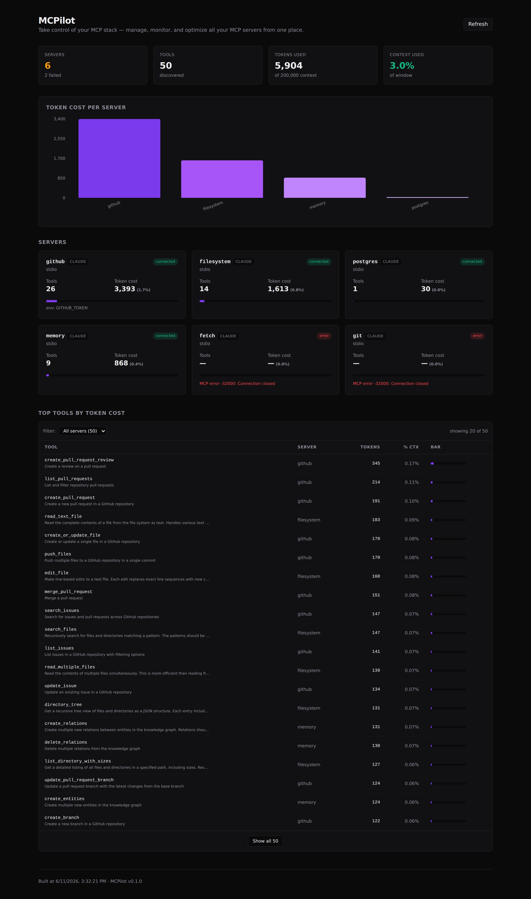

# MCPilot

> **Take control of your MCP stack — manage, monitor, and optimize all your MCP servers from one place.**

[](LICENSE)
[](https://nodejs.org)
[](https://www.typescriptlang.org)
[](https://modelcontextprotocol.io)
[](CONTRIBUTING.md)

---

## TL;DR

The MCP ecosystem has **13,000+ servers and 97M monthly SDK downloads** — and every host app (Claude Code, Cursor, VS Code, Codex) stores its MCP config in a different file. MCPilot finds them all, connects to each server, counts exactly how many tokens every tool description costs, and shows you the total damage.

```bash
npx mcpilot scan   # see every server + its token bill
npx mcpilot list   # see every tool on every server
npx mcpilot stats  # token cost leaderboard
npx mcpilot dashboard  # web UI on http://localhost:3000
```



---

## Why MCPilot?

**MCP tool descriptions eat 40-50% of your context window.** (Perplexity's CTO, publicly.)

When you connect a single MCP server with 20 tools to Claude, the model has to read all 20 tool names + descriptions + input schemas *every single turn* — just in case you want to call one. Stack three or four servers and you've burned half your context on metadata before you even type your question.

Existing tools each solve one piece:

- **[Headroom](https://github.com)** (21K⭐) — does *only* compression. No dashboard. No scanning.
- **[mcp-manager](https://github.com)** (94⭐) — does *only* management. No token accounting. No optimization.
- **[mcp-proxy](https://github.com)** — does *only* transport. No visibility into cost.

**MCPilot does all three:** scan configs across every host app, connect to each server, count tokens per tool, and (in v0.2) proxy with caching to cut the bill.

---

## Quick start

```bash
git clone https://github.com/ferre-z/mcpilot
cd mcpilot
npm install
npm run build --workspace=@mcpilot/core
npx tsx packages/cli/src/index.ts scan
```

Or run the dashboard:

```bash
npm run dev:dashboard
# → http://localhost:3000
```

After `npm run build --workspace=@mcpilot/cli` you can also install the CLI globally:

```bash
npm link
mcpilot scan
```

---

## Features

| Feature | What it does |
|---|---|
| **Multi-source scanner** | Reads `~/.claude/settings.json`, `~/.claude/mcp_servers.json`, `~/.cursor/mcp.json`, `~/.vscode/settings.json`, and `.mcp.json` in cwd |
| **Live connection** | Spawns each stdio server via the official MCP SDK, calls `tools/list`, parses every tool |
| **Token accounting** | Counts tokens with `js-tiktoken` (cl100k_base) for each tool's name + description + input schema |
| **Context %** | Shows what fraction of a 200K context window your tools consume (configurable) |
| **Status surfacing** | Auth failures, missing URLs, broken transports — all visible, never silent |
| **Web dashboard** | Next.js 14 with Recharts: server cards, bar chart, filterable tool table, savings counter |
| **Proxy cache** | In-process TTL cache (5 min) for `tools/list` responses — cuts redundant `tools/list` roundtrips |
| **JSON output** | Every CLI command supports `--json` for piping into scripts |

---

## Architecture

```
┌─────────────────────────────────────────────────────────────┐
│                        MCPilot                              │
│                                                             │
│   ┌──────────┐    ┌──────────┐    ┌──────────────────────┐  │
│   │ packages │    │ packages │    │   packages/          │  │
│   │   /cli   │    │  /core   │    │     dashboard        │  │
│   │          │    │          │    │                      │  │
│   │ commander│───▶│ scanner  │───▶│  Next.js 14          │  │
│   │   chalk  │    │ tokenize │    │  Recharts            │  │
│   │   table  │    │ registry │    │  Tailwind            │  │
│   │          │    │  proxy   │    │                      │  │
│   └──────────┘    └─────┬────┘    └──────────────────────┘  │
│                         │                                  │
│                         ▼                                  │
│                  ┌──────────────┐                          │
│                  │  MCP SDK     │                          │
│                  │ (@model-     │                          │
│                  │  context.../ │                          │
│                  │   sdk)       │                          │
│                  └──────┬───────┘                          │
└─────────────────────────┼───────────────────────────────────┘
                          │ stdio / SSE / streamable-http
                          ▼
              ┌───────────────────────┐
              │  MCP servers on disk  │
              │  (npx, docker, etc.)  │
              └───────────────────────┘
```

- **`packages/core`** — the brain. Pure TypeScript library, zero runtime deps on the dashboard. Exposes `scanAllConfigs`, `tokenizeServer`, `buildSnapshot`, `ProxyCache`, `truncateTools`.
- **`packages/cli`** — the surface. Uses `commander` for subcommands, `chalk` for color, `cli-table3` for tables. Lazy-loads the MCP SDK only when a live connection is needed.
- **`packages/dashboard`** — the picture. Next.js 14 App Router + Tailwind. Calls `core` directly via API routes (no separate backend). 30s in-memory cache for snappy refreshes.

---

## CLI usage

```text
$ mcpilot scan

🔍 Scanning MCP configurations...

Found 2 config file(s):
  ✓ ~/.claude/settings.json   (claude · 4 servers)
  ✓ ~/.cursor/mcp.json        (cursor · 3 servers)

┌────────────┬────────┬───────────┬───────┬──────────────┬──────────────────────┐
│ Server     │ App    │ Transport │ Tools │ Token Cost   │ Bar                  │
├────────────┼────────┼───────────┼───────┼──────────────┼──────────────────────┤
│ github     │ claude │ stdio     │ 26    │ 3,393 (1.7%) │ ███████░░░░░░░░░░░░░ │
│ filesystem │ claude │ stdio     │ 14    │ 1,613 (0.8%) │ ███░░░░░░░░░░░░░░░░░ │
│ memory     │ claude │ stdio     │  9    │   868 (0.4%) │ ██░░░░░░░░░░░░░░░░░░ │
│ ...        │        │           │       │              │                      │
├────────────┼────────┼───────────┼───────┼──────────────┼──────────────────────┤
│ TOTAL      │        │           │ 50    │ 5,904 (3.0%) │                      │
└────────────┴────────┴───────────┴───────┴──────────────┴──────────────────────┘

💡 Top context hogs: github (1.7%), filesystem (0.8%), memory (0.4%)
```

```bash
mcpilot list              # all servers + their tools, with descriptions
mcpilot list --json       # machine-readable
mcpilot stats             # per-tool leaderboard
mcpilot stats --top 5     # top 5
mcpilot stats --context 1000000   # assume a 1M context
mcpilot proxy start       # in-process tool-list cache (5min TTL)
mcpilot dashboard         # launch the web UI
```

All commands accept `--cwd <path>` and `--home <path>` to point at non-standard config locations (useful for testing).

---

## Comparison

| Tool | Scan configs | Connect to servers | Count tokens | Dashboard | Proxy/cache | License |
|---|---|---|---|---|---|---|
| **MCPilot** | ✅ all hosts | ✅ live | ✅ per-tool | ✅ dark theme | ✅ cache + truncate | MIT |
| Headroom | ❌ | ❌ | ✅ (truncate) | ❌ | ✅ | MIT |
| mcp-manager | ✅ | ❌ | ❌ | ✅ (basic) | ❌ | MIT |
| mcp-proxy | ❌ | ✅ (passthrough) | ❌ | ❌ | ✅ (passthrough) | MIT |
| mcp-inspector | ❌ | ✅ (one server) | ❌ | ❌ (desktop app) | ❌ | MIT |

---

## How token counting works

We use [`js-tiktoken`](https://github.com/dqbd/tiktoken) with the `cl100k_base` encoding — the same tokenizer used by Claude and GPT-4. For each tool we count:

```
tokens = encode(JSON.stringify({
  name: tool.name,
  description: tool.description,
  input_schema: tool.inputSchema,
}))
```

That matches what an LLM actually sees in its system prompt when a tool is offered. The total across all tools is your "context tax."

> Note: exact token counts vary by model. Anthropic's tokenizer differs by ~5-10% from `cl100k_base`, but the relative magnitudes are correct — the leaderboard ranking is reliable even if the absolute numbers drift.

---

## Output JSON schema

`mcpilot scan --json` returns:

```json
{
  "configFiles": [
    { "path": "/home/you/.claude/settings.json", "app": "claude", "serverCount": 4 }
  ],
  "servers": [
    {
      "name": "github",
      "source": "/home/you/.claude/settings.json",
      "sourceApp": "claude",
      "transport": "stdio",
      "command": "npx",
      "args": ["-y", "@modelcontextprotocol/server-github"],
      "env": { "GITHUB_TOKEN": "<redacted>" },
      "enabled": true
    }
  ]
}
```

`mcpilot stats --json` adds per-tool detail and per-server totals — see [docs/api.md](docs/api.md).

---

## Roadmap

- [x] **v0.1** (this release) — scanner, tokenizer, CLI, web dashboard, in-process cache
- [ ] **v0.2** — full MCP proxy server (stdio ↔ stdio, stdio ↔ HTTP) with on-the-fly `tools/list` truncation
- [ ] **v0.3** — file watcher: re-scan when config files change
- [ ] **v0.4** — per-server enable/disable that writes back to the source config
- [ ] **v0.5** — daemon mode: long-running process, system tray icon
- [ ] **v0.6** — export to other managers (`.mcp.json` ↔ Claude Code settings ↔ Cursor config)

---

## Contributing

PRs welcome. The MVP deliberately ships with no test suite so the surface is small and readable — please add tests for new logic.

```bash
# Development
npm install
npm run typecheck              # all packages
npm run scan                   # quick CLI test
npm run dev:dashboard          # dashboard with hot reload

# Before opening a PR
npm run build                  # build @mcpilot/core + cli + dashboard
```

Coding style:
- TypeScript strict mode, no `any` unless wrapping a foreign type
- ESM only (`"type": "module"`)
- All config parsing must be defensive (try/catch + graceful fallback)

See [CONTRIBUTING.md](CONTRIBUTING.md) for more.

---

## License

MIT — see [LICENSE](LICENSE).

---

## Acknowledgements

- The [Model Context Protocol](https://modelcontextprotocol.io) team for the SDK and the spec
- Anthropic, Cursor, VS Code, and the broader MCP ecosystem for making this a useful problem
- [js-tiktoken](https://github.com/dqbd/tiktoken) for fast BPE tokenization
- Every maintainer of an MCP server listed in [the awesome-mcp-servers list](https://github.com/punkpeye/awesome-mcp-servers)
